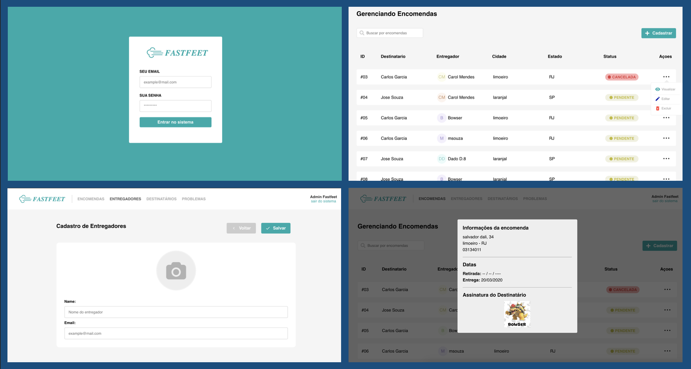

# Fastfeet - WEB

## Getting Started

This project was developed to complete the `rocketseat bootcamp`, here you can find details about the `web app` part.

## How to test this implementation

### Prerequisites

In the project directory `../fastfeet/fastfeet-web`, you can run:

- `yarn`: Intalling dependencies
- `yarn start` : Start in development mode

Runs the app in the development mode. 
Open [http://localhost:3000](http://localhost:3000) to view it in the browser.

## Project Structure

### Screens

As well as an `admin-like` app, this app offers some **CRUD** interactions for these screens below

- Here you can find some screenshots of some pages

 

## Built With

- [Create React App](https://create-react-app.dev/) - Set up a modern web app by running one command.
- [Styled Components](https://www.styled-components.com/) - Visual primitives for the component age. Use the best bits of ES6 and CSS to style your apps without stress
- [React Icons](https://react-icons.netlify.com/#/) - Popular icons in your React projects
- [Immer](https://github.com/immerjs/immer) - Create the next immutable state by mutating the current one

## Author

- **Marcio Mendes** - [mmendesas](https://github.com/mmendesas)
