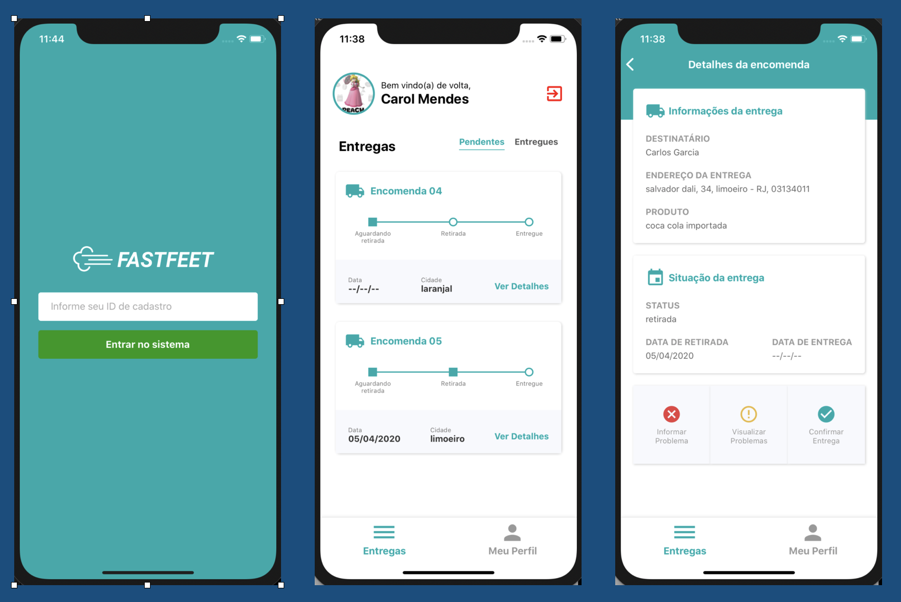
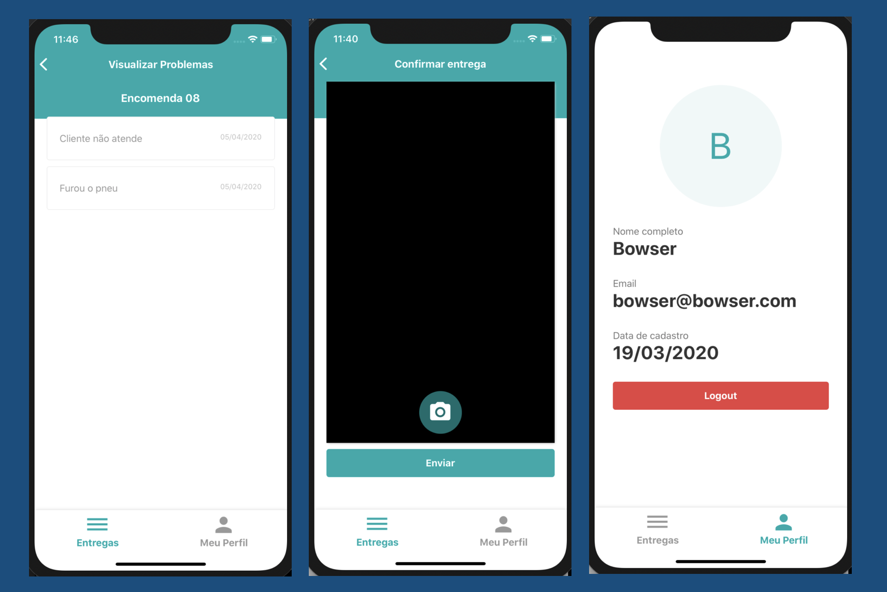

# Fastfeet - MOBILE

## Getting Started

This project was developed to complete the `rocketseat bootcamp`, here you can find details about the `mobile app` part.

## How to test this implementation

### Prerequisites

In the project directory `../fastfeet/fastfeet_mobile`, you can run:

- `yarn`: Intalling dependencies
- `yarn react-native run-ios --simulator="iPhone 11"` : Start in development mode

> This app was only tested in iOS simulator

## Project Structure

### Screens

This app shows a lot of screens and provides some functionalities to deliveryman, see some of them on these screens below

- Here you can find some screenshots of some pages

 
 

## Built With

- [React Native](https://reactnative.dev/) - A framework for building native apps using React
- [Styled Components](https://www.styled-components.com/) - Visual primitives for the component age. Use the best bits of ES6 and CSS to style your apps without stress
- [React Icons](https://react-icons.netlify.com/#/) - Popular icons in your React projects
- [Immer](https://github.com/immerjs/immer) - Create the next immutable state by mutating the current one

## Author

- **Marcio Mendes** - [mmendesas](https://github.com/mmendesas)
